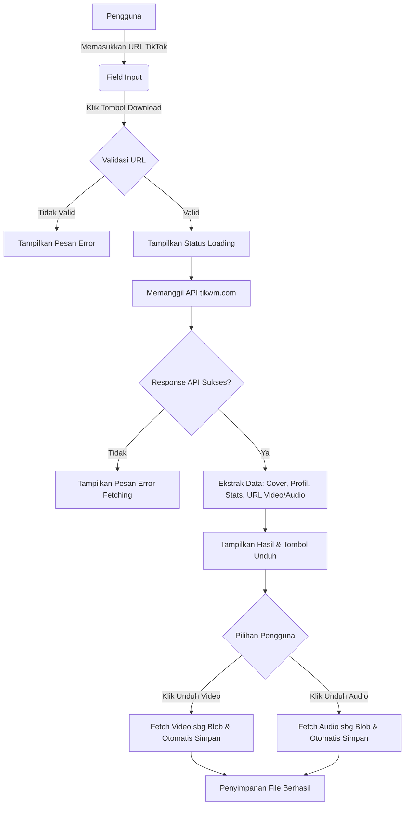

# Spectre - TikTok Video Downloader

Spectre adalah aplikasi web sederhana dan elegan yang memungkinkan pengguna untuk mengunduh video TikTok tanpa *watermark* (tanda air) serta mengunduh audionya dengan kualitas premium secara gratis. 

Proyek ini dibangun menggunakan HTML, CSS, dan JavaScript Native, menjadikannya cepat dan responsif tanpa bergantung pada framework berat.

## 🚀 Fitur Utama
- **Tanpa Watermark**: Unduh video TikTok berkualitas tinggi tanpa logo TikTok.
- **Unduh Audio**: Ekstrak dan unduh musik/audio langsung dari tautan video TikTok.
- **Informasi Video**: Menampilkan pratinjau thumbnail, foto profil kreator, nama, deskripsi video, serta statistik (jumlah diputar & jumlah suka).
- **Desain Modern**: Antarmuka yang bersih (UI) dengan kursor kustom dan efek animasi yang halus.
- **Responsif**: Mendukung berbagai ukuran layar baik desktop maupun perangkat seluler.

## 🛠️ Teknologi yang Digunakan
- **HTML5**: Struktur halaman web.
- **CSS3**: Tata letak, warna (Gaya Glassmorphism & Gradient), dan animasi (termasuk efek kursor kustom).
- **JavaScript (Vanilla)**: Menangani interaksi pengguna, panggilan API, format data, dan logika pengunduhan (unduhan *Blob* untuk menghindari redirect terbuka bila memungkinkan).
- **API**: Menggunakan [tikwm.com API](https://www.tikwm.com/) untuk mengambil data video melalui URL.

## ⚙️ Cara Penggunaan (Secara Lokal)
1. **Clone** repositori ini atau **Unduh** folder proyek ke komputer Anda.
2. Buka folder proyek tersebut (`Spectre TikTok Downloader`).
3. Klik dua kali pada file `index.html` untuk membukanya di browser web Anda, atau gunakan ekstensi seperti **Live Server** di VSCode.
4. Salin (Copy) tautan video dari aplikasi atau situs web TikTok.
5. Tempelkan (Paste) tautan pada kotak input yang disediakan di Spectre.
6. Klik tombol **Download** dan tunggu proses pengambilan data.
7. Pilih **Download Video** atau **Download Audio** sesuai dengan kebutuhan Anda.

## Alur Kerja Sistem (Mermaid Diagram)

Berikut adalah visualisasi bagaimana program Spectre memproses permintaan unduhan pengguna:

## Pengembang
- **Dibuat oleh:** Tycami Tech
- **Hak Cipta:** &copy; 2025 Spectre.

---
*Catatan: Proyek ini menggunakan API Publik, dan performa fetch data tergantung pada layanan API pihak ketiga.*
